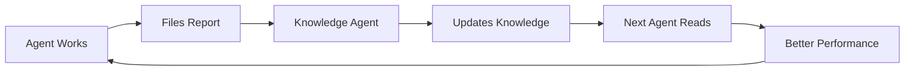

# 🔄 The Autonomous Knowledge Loop: Breaking the Human Bottleneck

## The Current Problem
Chris manually updates manuals with agent insights. This doesn't scale and breaks the autonomous flow.

## The Solution: Knowledge Base Agent

### Architecture:
```yaml
CLAUDE_KNOWLEDGE.md
├── Delegate Best Practices (auto-updated)
├── Common Solutions (auto-updated)
├── Tool Usage Patterns (auto-updated)
└── Agent Success Stories (auto-updated)

.claude/field-test-reports/
├── [agent reports]
└── processed.log (tracking file)
```

### Implementation:

#### 1. Daily Knowledge Consolidator
```markdown
You are the Knowledge Consolidator Agent. Your mission: Update CLAUDE_KNOWLEDGE.md daily.

Tasks:
1. Read all new field reports since last run
2. Extract patterns, tips, and solutions
3. Update CLAUDE_KNOWLEDGE.md sections
4. Mark processed reports in processed.log
5. No human intervention needed
```

#### 2. Pre-Mission Briefing
Every Task Agent prompt starts with:
```markdown
IMPORTANT: First read CLAUDE_KNOWLEDGE.md for latest insights from other agents.
Then read REVOLUTION/06-claude-task-agent-manual.md + REVOLUTION/06-claude-task-agent-manual-v2.md for base instructions.
```

#### 3. Smart Categorization
The Knowledge Agent maintains sections:
```markdown
## Delegate Mastery
- [Auto-extracted tips from field reports]

## Problem-Solution Pairs
- Chrome issues → Use Node.js approach
- Code fences → sed '1d;$d' or delegate cleanup
- [More auto-extracted patterns]

## Performance Records
- Largest file generated: X lines (Agent Y)
- Most tokens saved: X (Agent Z)
- [Auto-updated from reports]
```

### Automation Triggers:

#### Option 1: Time-Based (Cron)
```bash
# Run daily at 3 AM
0 3 * * * cd /project && npm run consolidate-knowledge
```

#### Option 2: Session-Based
Team Lead starts each session:
```markdown
"First, deploy Knowledge Consolidator to update our collective intelligence."
```

#### Option 3: Report-Triggered  
After every 10 field reports:
```markdown
"Knowledge update needed - deploying consolidator."
```

### The Knowledge File Structure:

```markdown
# CLAUDE_KNOWLEDGE.md
*Last updated: [timestamp] by Knowledge Agent v[x]*
*Reports processed: [count]*

## 🔥 Hot Tips (Last 7 Days)
[Recent discoveries, sorted by impact]

## 🛠️ Delegate Mastery
### Code Fence Handling
- sed '1d;$d' method (Battle Artist, 2025-06-22)
- Delegate cleanup method (Shop Keeper, 2025-06-22)
[Auto-extracted and attributed]

## 🎯 Problem → Solution Database
| Problem | Solution | Success Rate | Discovered By |
|---------|----------|--------------|---------------|
| Chrome deps | Node.js tests | 100% | Test Runner |
[Auto-populated table]

## 📊 Performance Benchmarks
[Auto-updated from field reports]

## 🚀 Innovation Gallery
[Creative solutions worth highlighting]
```

### Benefits:

1. **Zero Human Overhead**: Fully autonomous
2. **Collective Intelligence**: Every agent benefits
3. **Pattern Recognition**: Trends emerge automatically
4. **Credit Attribution**: Agents get recognition
5. **Performance Tracking**: Metrics improve over time

### Implementation Code:

```typescript
// consolidate-knowledge.ts
async function consolidateKnowledge() {
  const reports = await readUnprocessedReports();
  const insights = extractInsights(reports);
  const currentKnowledge = await readKnowledgeBase();
  const updated = mergeAndDeduplicate(currentKnowledge, insights);
  await writeKnowledgeBase(updated);
  await markProcessed(reports);
}
```

### Escape Hatches:

1. **Quality Control**: Team Lead can review major updates
2. **Manual Override**: Chris can add critical insights
3. **Versioning**: Keep history of knowledge evolution
4. **Filtering**: Remove outdated patterns automatically

## The Result: True Autonomous Learning



No human needed. Knowledge compounds. System improves. The REVOLUTION achieves its final form.

---

*"The best documentation is the one that writes itself."*